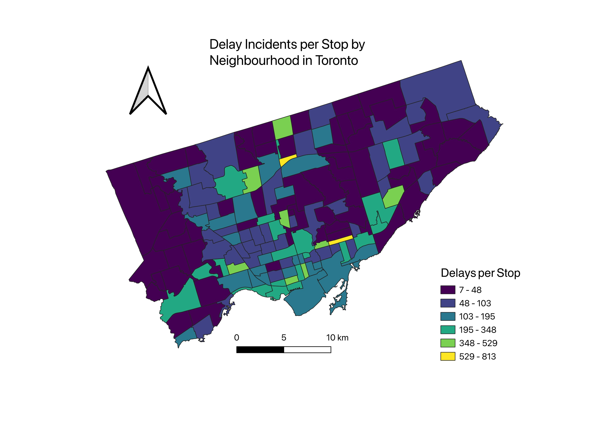

# TTC Delay Rate by Neighbourhood — QGIS Demonstration

A cartographic demonstration of TTC transit delay patterns across Toronto 
neighbourhoods, created using QGIS and Python.

## Visualisation

## Methodology

This map shows **transit delay incidents per transit stop** for each Toronto 
neighbourhood, providing an approximate service-normalised view of delay intensity.

**Data sources:**

- Geocoded TTC delay incidents (2014–2025) from my [transit delay modelling project](https://zdaulat.quarto.pub/ttc-delays-modelling/)
- Transit stops from the recent TTC GTFS feed (January 2026)
- Neighbourhood boundaries from Toronto Open Data Portal

**Metric:** `delay_count / stop_count` for each neighbourhood

**Limitations:**

- Stops reflect current (2026) GTFS feed; historical stop locations varied
- Neighbourhood boundaries reflect post-2024 revision
- Delay incidents on boundary streets are assigned to whichever polygon contains the geocoded point
- This is a methodological demonstration, not a production analysis

## Data Preparation

The `delays_r_prep.R` script extracts geocoded delay point geometries 
from the transit delay modelling project's geocoded delays dataset and 
exports them as a GeoPackage for use in QGIS. It includes the bit of
troubleshooting code I used as well.

## Python Script

The `delays_per_stop.py` script automates the analysis workflow 
in QGIS, demonstrating:

- Loading vector layers (GeoPackage, delimited text)
- Spatial analysis with `processing.run()`
- Field calculation and attribute manipulation
- Output generation

The actual data processing and map construction was done using the QGIS GUI.
The Python script shows how I reproduced the analytical workflow and output 
(delay rates by neighbourhood) programmatically. Final cartographic styling 
(colour ramp, legend, scale bar) was done using the QGIS GUI and Print Layout.

## Tools

- QGIS 3.44.7-Solothurn
- Python (via QGIS Python Console)
- R/sf for initial data preparation and geocoding pipeline